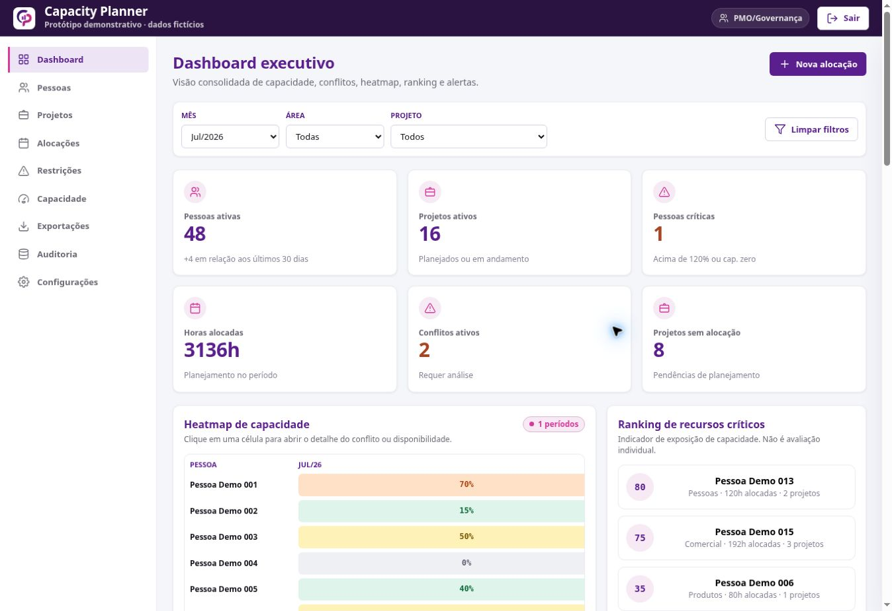

# Capacity Planner — demonstração pública

Protótipo estático para explorar planejamento de pessoas, projetos, alocações, restrições e indicadores de capacidade. A base contém somente registros sintéticos, identificados por `DEMO` e endereços `example.com`.

## Acessar a demonstração

[Abrir Capacity Planner](https://guilhermehss1.github.io/Capacity-Planner/). A página é pública e utiliza dados fictícios. O período inicial de julho de 2026 é um cenário ilustrativo que contém exemplos de conflitos de capacidade; é possível selecionar outros períodos no filtro.

## Executar

Na pasta do projeto, execute `python3 -m http.server 8000` e abra `http://localhost:8000`. É possível usar a opção **Entrar como PMO** ou os perfis demonstrativos. O formulário de acesso é simulado: nenhuma autenticação é realizada e não há senha.

## Dados e armazenamento

A base de exemplo está em `data/seed.js`. Alterações feitas na interface são salvas apenas no `localStorage` do navegador; a sessão simulada usa `sessionStorage`. Para recomeçar com a base sintética, use **Configurações → Restaurar demo**. Se você abriu uma versão anterior no mesmo endereço, limpe o armazenamento local ou recarregue a página: a versão da base faz a atualização automática dos dados persistidos.

Os números de capacidade, pessoas e projetos são exemplos. Não representam operações, funcionários ou planejamento de nenhuma empresa real.
